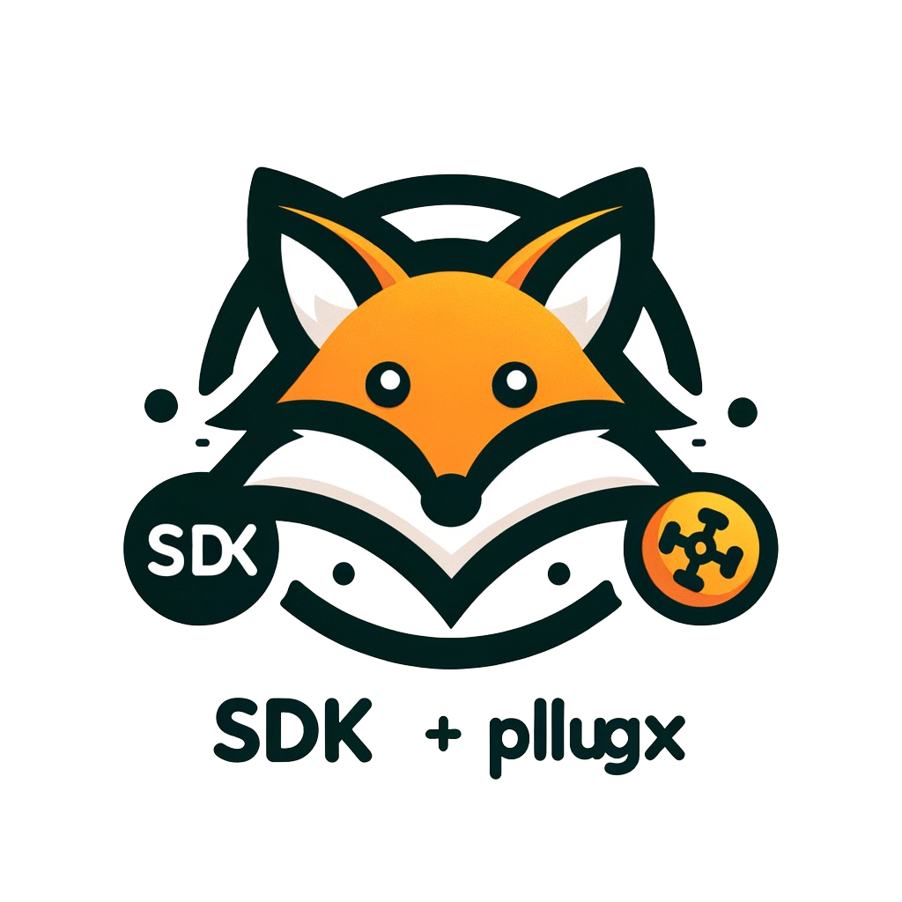

<p style="" align="center">
  
</p>

# vfox

[](https://goreportcard.com/report/github.com/version-fox/vfox)
[](LICENSE)
[](https://github.com/version-fox/vfox/releases)


[[English]](./README.md)  [[中文文档]](./README_CN.md)

如果你经常需要在**各种开发项目之间切换**，而这些项目又各自**需要不同的运行环境**，尤其是不同的运行时版本或环境库, 或者
**厌倦了各种繁琐的环境配置**，那么 `vfox` 就是你的不二选择。
## 介绍

`vfox` 是一个跨平台版本管理器（类似于 `nvm`、`fvm`、`sdkman`、`asdf-vm` 等），可通过插件扩展。它允许您快速安装和切换您需要的环境。
## 为什么选择 vfox？

- 支持**Windows(非WSL)**、Linux、macOS!
- 支持**不同项目不同版本**、**不同Shell不同版本**以及**全局版本**
- 简单的 **插件系统** 来添加对你选择的语言的支持
- 在您切换项目时, 帮您**自动切换**运行时版本
- 支持现有配置文件 `.node-version`、`.nvmrc`、`.sdkmanrc`，以方便迁移
- 支持常用Shell(Powershell、Bash、ZSH),并提供补全功能

## 演示

[](https://asciinema.org/a/650100)

## 快速入门

> 详细的安装指南请参见 [快速入门](https://vfox.dev/zh-hans/guides/quick-start.html)

#### 1.选择一个适合你的[安装方式](https://vfox.dev/zh-hans/guides/quick-start.html#_1-%E5%AE%89%E8%A3%85vfox)。

#### 2. ⚠️ **挂载vfox到你的 Shell (从下面选择一条适合你 shell 的命令)** ⚠️

```bash
echo 'eval "$(vfox activate bash)"' >> ~/.bashrc
echo 'eval "$(vfox activate zsh)"' >> ~/.zshrc
echo 'vfox activate fish | source' >> ~/.config/fish/config.fish

# 对于 PowerShell
if (-not (Test-Path -Path $PROFILE)) { New-Item -Type File -Path $PROFILE -Force | Out-Null }
$vfoxLine = 'Invoke-Expression "$(vfox activate pwsh)"'
$profileContent = Get-Content -Path $PROFILE -Raw
if ($profileContent -notmatch [regex]::Escape($vfoxLine)) {
  if ($profileContent.Length -gt 0 -and -not $profileContent.EndsWith("`r`n") -and -not $profileContent.EndsWith("`n")) {
    Add-Content -Path $PROFILE -Value ""
  }
  Add-Content -Path $PROFILE -Value $vfoxLine
}

# 对于 Clink:
# 1. 安装 clink: https://github.com/chrisant996/clink/releases
#    或者安装 cmder: https://github.com/cmderdev/cmder/releases
# 2. 找到脚本路径: clink info | findstr scripts
# 3. 复制 internal/shell/clink_vfox.lua 到脚本路径

# 对于 Nushell:
vfox activate nushell $nu.default-config-dir | save --append $nu.config-path
```

> 请记住重启你的 Shell 以应用更改。

#### 3.添加插件
```bash 
$ vfox add nodejs
```

#### 4. 安装运行时

```bash
$ vfox install nodejs@21.5.0
```

#### 5. 切换运行时

```bash
$ vfox use nodejs@21.5.0
$ node -v
21.5.0
```

## 完整文档

请浏览 [vfox.dev](https://vfox.dev) 查看完整文档。

## 目前支持的插件

> 如果您已经安装了 `vfox`，您可以使用 `vfox available` 命令查看所有可用的插件。

请看 [可用插件列表](https://vfox.dev/zh-hans/plugins/available.html)

## 路线图

我们未来的计划以及高度优先的功能和增强功能是：
- [X] 重构插件机制:
  - 增加插件模板, 允许多文件开发插件
  - 增加全局注册表(类似于:`NPM Registry`、`Scoop Main Bucket`), 为插件分发提供统一入口
  - 拆分现有的插件仓库, 一个插件一个仓库
- [X] 允许切换注册表地址
- [X] 插件能力: 允许插件解析旧版本的配置文件. 例如: `.nvmrc`, `.node-version`, `.sdkmanrc`等
- [ ] 插件能力: 允许插件加载已安装的运行时, 并提供运行时的信息

## 贡献者

> 感谢以下贡献者对本项目的贡献。🎉🎉🙏🙏

<a href="https://github.com/version-fox/vfox/graphs/contributors">
  
</a>


## Star History


## 感谢
> 感谢 JetBrains 提供免费开源许可 : )

<a href="https://www.jetbrains.com/?from=gev" target="_blank">
	
</a>

<a href="https://hellogithub.com/repository/a32a1f2ad04a4b8aa4dd3e1b76c880b2" target="_blank"></a>


## COPYRIGHT

[Apache 2.0 license](./LICENSE) - Copyright (C) 2026 Han Li
and [contributors](https://github.com/version-fox/vfox/graphs/contributors)
